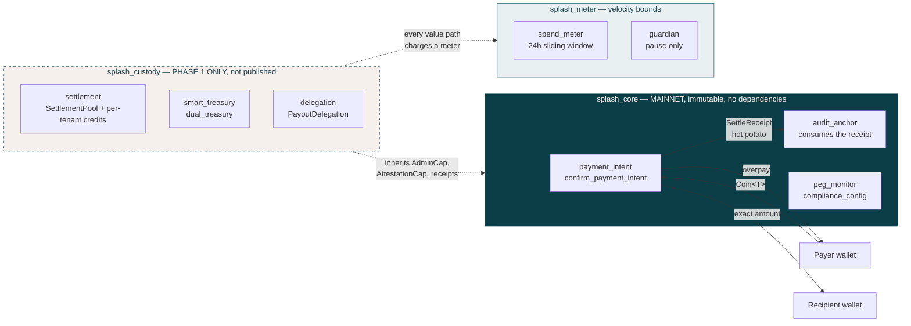

# Splash Finance

Splash Finance is a B2B cross-border settlement prototype for SEA exporters, marketplaces, and payroll operators. The app uses Next.js App Router, React Query, Tailwind CSS, server-driven settlement APIs, and Sui Move contracts.

## Architecture

Splash holds no financial-services licence today; a Labuan FSA money-broking
application is in preparation with counsel. Splash **cannot hold client funds** —
a constraint that is self-imposed rather than licence-derived, and not a runtime
flag either: it is a property of the type system. `splash_core`, the package
that publishes to mainnet, contains no struct that can hold a `Balance`. Every
struct that can lives in `splash_custody`, which is **not published** until the
e-money licence is granted.



**Read the diagram this way:** client value enters as a `Coin` parameter and
leaves in the same transaction. There is no object in `splash_core` to accumulate
into — `npm run lint` runs `scripts/check-core-no-balance.mjs`, which fails the
build if one ever appears. The dashed box is bytecode that does not exist on
chain in Phase 0, so its functions cannot be called, flagged, or bypassed.

See [`STATUS.md`](./STATUS.md) for the phase gate and
[`SECURITY.md`](./SECURITY.md) for the audit trail.

## Toolchain

**Sui CLI >= 1.61.1 is required.** Below that, `sui move test` fails in
`move/splash_custody` with errors pointing at *DeepBook's own test files*
(`unbound function 'destroy'`) — which looks like a broken dependency but is not.

`sui move test` compiles a git dependency's test files. DeepBook's tests use
`std::unit_test::destroy`, added in sui `d95572e1c1` (#24078) and first shipped
in `testnet-v1.61.1`. On older CLIs the stdlib exports only `assert_eq` and
`assert_ref_eq`, so the build aborts before this repo's modules are reached.

```bash
choco upgrade sui -y
```

Windows: this needs an **elevated** shell. Without one it fails on
`C:\ProgramData\chocolatey` permissions and still prints a success-looking
summary — check the tail says `upgraded 1/1 packages`, not `0/0`.

## Features

- Landing page with Splash hero, trust rail, feature bento grid, batch payout preview, FPX simulation, and footer.
- Business dashboard with overview, transfer, batch payout, and KYB settings routes.
- Seven-step single-transfer wizard with quote, TOTP authorization, server status polling, and printable receipt.
- CSV batch payout flow with PapaParse and server-side batch authorization.
- KYB upload API that records encrypted-storage metadata, document SHA-256 hashes, and a KYB case ID.
- Separate staff admin console for KYB approvals, support replies, and complaint management.
- Two Move packages: `splash_core` (mainnet, holds no client value) and `splash_custody` (publishes on the Labuan e-money licence). See STATUS.md.

## Environment

Create `.env.local` with:

```bash
NEXT_PUBLIC_APP_URL=http://localhost:3000
NEXT_PUBLIC_SUPPORT_EMAIL=support@splash.finance

SUI_NETWORK=testnet
SUI_RPC_URL=
SPLASH_CORE_PACKAGE_ID=0x...
# Empty in Phase 0 — that is the regulatory posture, not a misconfiguration.
SPLASH_CUSTODY_PACKAGE_ID=
# Legacy single-package id, still honoured for pre-split deployments.
SPLASH_PACKAGE_ID=0x...
SPLASH_TREASURY_ID=0x...
USDC_TYPE=0x2::sui::SUI
ENOKI_API_KEY=
OPERATOR_SUI_ADDRESS=0x...

SUMSUB_APP_TOKEN=
SUMSUB_SECRET_KEY=
SUMSUB_LEVEL_NAME=splash-kyb
SUMSUB_BASE_URL=https://api.sumsub.com

ADMIN_EMAIL=staff@splash.finance
ADMIN_PASSWORD=
ADMIN_SESSION_SECRET=

CUSTOMER_EMAIL=demo@splash.finance
CUSTOMER_PASSWORD=
CUSTOMER_ORGANIZATION=Splash Demo Ltd
CUSTOMER_SESSION_SECRET=
CUSTOMER_SELF_SIGNUP_ENABLED=false
CUSTOMER_RECOVERY_EMAIL=support@splash.finance
```

Use a real coin type for `USDC_TYPE` after publishing or selecting a testnet USDC-compatible coin. The default SUI type is useful for local/test transactions only.
In production, set `CUSTOMER_EMAIL`, `CUSTOMER_PASSWORD`, and
`CUSTOMER_SESSION_SECRET`; leave `CUSTOMER_SELF_SIGNUP_ENABLED=false` unless
customer signup is backed by a real provisioning and persistence flow. Set
`CUSTOMER_RECOVERY_EMAIL` to the verified support inbox used for locked-out
workspace operators.

## Development

```bash
npm run dev
```

Open `http://localhost:3000`.

## Validation

```bash
npm run lint
npx tsc --noEmit
npm run build
```

Move package validation:

```bash
sui move build
```

## Move publish flow

There is no `move/Move.toml` — `move/` holds three packages, each built from its
own directory:

```bash
cd move/splash_core   && sui move build && sui move test   # 14 tests
cd move/splash_meter  && sui move build && sui move test   # 22 tests
cd move/splash_custody && sui move build && sui move test  # 16 tests
```

**Phase 0 publishes `splash_core` ONLY.** `splash_custody` holds every
`Balance` in the system and publishes when the Labuan e-money licence is
granted — leaving it unpublished is the control, not an oversight. `splash_core`
publishes **immutable** (UpgradeCap burned); see
[`docs/KEY-CEREMONY-RUNBOOK.md`](./docs/KEY-CEREMONY-RUNBOOK.md).

When you are ready to publish to testnet, run only after explicit confirmation:

```bash
sui client publish --gas-budget 100000000
```

After publishing:

1. Sign in at `/admin/login` and open **Contract config** in the sidebar.
2. Paste the new package, treasury, admin cap, peg state, business
   account, and transfer coin IDs into the form and save. Changes apply
   to the next request — no server restart required.

`.env.local` still works as the boot-time fallback. See
[`docs/contract-config.md`](./docs/contract-config.md) for details and
[`docs/openapi.yaml`](./docs/openapi.yaml) for the admin API contract.

## Important routes

- `/` landing page
- `/login`
- `/signup`
- `/forgot-password`
- `/dashboard`
- `/dashboard/transfer`
- `/dashboard/batch`
- `/dashboard/settings`
- `/settings/kyb`
- `/admin/login`
- `/admin`
- `/admin/kyb`
- `/admin/support`
- `/admin/contracts`
- `/transfer/fpx`
- `/api/kyb/upload`
